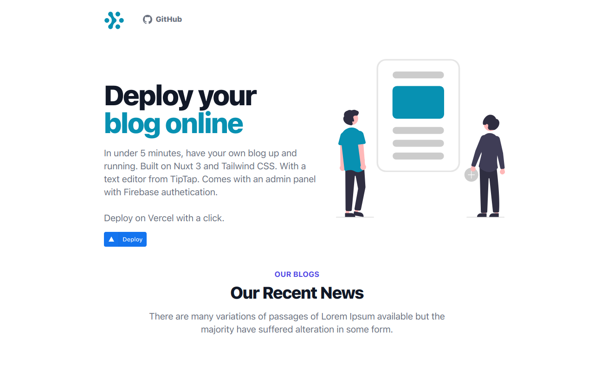

# Blogger



A Nuxt 3 Blog Template styled with Tailwind CSS with Firebase integration. Comes with a Rich Text Editor from TipTap and image uploads with Cloudinary. 

Deploy it on Vercel with a click.

[](https://vercel.com/new/clone?repository-url=https%3A%2F%2Fgithub.com%2Fbalsimpson%2Fblogger&env=FIREBASE_API_KEY,FIREBASE_PROJECT_ID,CLOUDINARY_NAME&envDescription=All%20Environment%20variables%20are%20required.&project-name=blogger&repo-name=blogger&demo-description=A%20blog%20template%20made%20in%20Nuxt%203%20and%20styled%20by%20Tailwind%20CSS.&demo-url=http%3A%2F%2Fblogger-livid.vercel.app%2F&demo-image=https%3A%2F%2Fres.cloudinary.com%2Ftinkrshop%2Fimage%2Fupload%2Fv1661431359%2Fblog%2Fs5e51rf8far73jza4ul3.png)

## Accessing Admin panel

Once your app is deployed on Vercel, access the admin panel at your-site-name.vercel.app`/admin`.

> Create a user on Firebase and use those credentials to sign in.

> If you have not added/used Firestore in your project, make sure to activate it by clicking the `Create Database` button on Firestore Console.


<br>


## Install TipTap
```
# install tiptap
npm install @tiptap/vue-3 @tiptap/starter-kit @tiptap/extension-underline @tiptap/extension-text-align @tiptap/extension-placeholder @tiptap/extension-image @tiptap/extension-heading @tiptap/extension-code @tiptap/extension-character-count @tiptap/extension-bubble-menu @tiptap/extension-link @tiptap/extension-highlight @tiptap/extension-youtube @tiptap/extension-code-block-lowlight

npm install -D @tailwindcss/typography

# update tailwind.config.js
plugins: [require('@tailwindcss/typography'),],
```

## Install @iconify-prerendered
```
npm i @iconify-prerendered/vue-fa6-solid
npm i @iconify-prerendered/vue-fa6-regular
npm i @iconify-prerendered/vue-fa6-brands
```

```
<script setup>
import { IconAccount } from '@iconify-prerendered/vue-mdi' 
</script>

<template>
<a>
  <IconAccount/>
  Go to account
</a>
</template>
```
